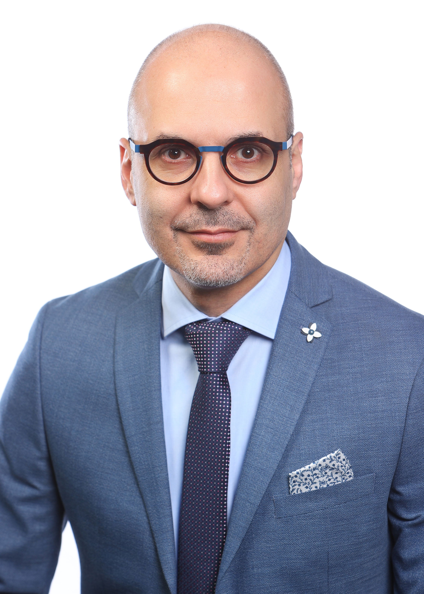
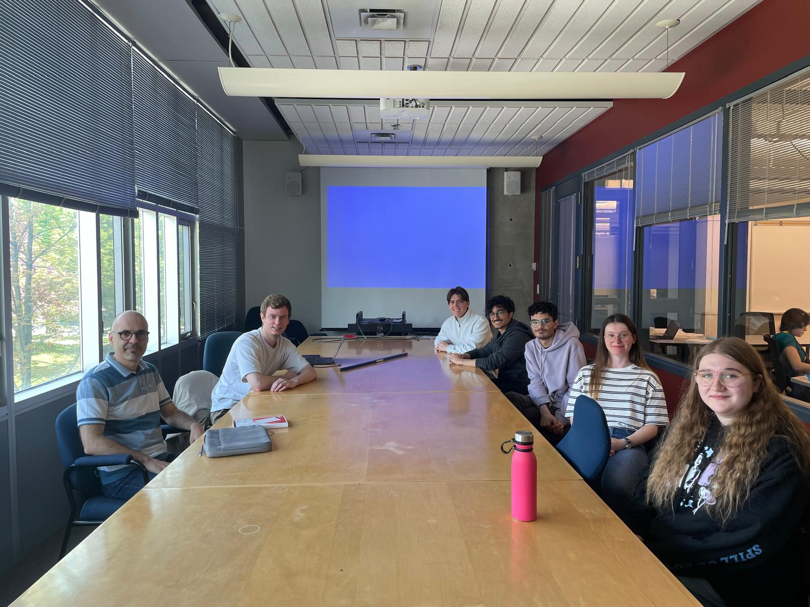

::: {.hero}
::: {.hero-text}
**Associate Professor and University Research Chair**  
**Faculty of Computer Science, Dalhousie University**

My research focuses on reliable and secure wireless networks, with emphasis on spectrum and energy efficiency, interference mitigation, and anomaly detection.

I hold a PhD in Computer Science from IMT Atlantique, Rennes and a [habilitation](habilitation.qmd) from Université Paris-Saclay in France for my work on radio resource allocation in cellular networks.
:::

::: {.hero-media}

:::
:::

## Spark Lab

::: {.lab-highlight}
::: {.lab-highlight-media}

:::

::: {.lab-highlight-text}
I lead **Spark Lab** at Dalhousie University, where students and collaborators study wireless systems through theory, optimization, measurement, and learning-based methods. Our work connects wireless networking, IoT, security, and intelligent communication systems.

**Current Research Directions**

- Anomaly detection in wireless networks
- Low-power wide-area Networks for wireless IoT
- Wireless coexistence in unlicensed spectrum
- Seamless transitions between cellular networks

[Meet the lab](lab.qmd)
:::
:::

## News

::: {.news-list}
::: {.news-item}
**May 2026**  `Tutorial` `IEEE CCECE` `Semantic Communication`  
I will deliver the tutorial **Semantic Communication for Wireless IoT: Frameworks, Optimization, and Open Challenges** at **IEEE CCECE 2026**. [More details](https://ccece2026.ieee.ca/program/tutorials/)
:::

::: {.news-item}
**January 2026**  `Grant` `Mobility` `Security`  
Awarded a DND IDEaS contract for **TOPSSIM: Trustworthy Operator Platform for Seamless and Secure Inter-PLMN Mobility**.
:::

::: {.news-item}
**November 2025**  `Grant` `IoT Security` `AI`  
Received NCC Cyber Security Innovation Network grant for **AI-Driven IoT Threat Intelligence: Securing Smart Environments Across Zigbee, Z-Wave, Bluetooth, and Wi-Fi Networks**.
:::

::: {.news-item}
**2025-2026**  `Student Paper` `Conference` `LR-FHSS`  
Student work by **Juliana El Rayess** was presented at **WPMC 2025** and accepted at **CCNC 2026** on energy efficiency and reliability in LR-FHSS networks.
:::
:::
