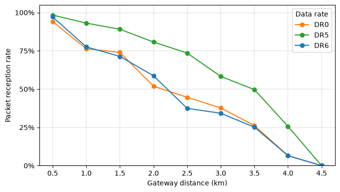

This resource provides open LoRaWAN field measurements collected in Halifax, Nova Scotia, comparing LoRa DR0 with LR-FHSS DR5 and DR6 in the `US915` band.

## Overview

The dataset supports the experimental study of Long Range Frequency Hopping Spread Spectrum (LR-FHSS) as a physical-layer option for LoRaWAN. It provides a real-world comparison of conventional LoRa `DR0` with LR-FHSS `DR5` and `DR6` in the `US915` band, with measurements suitable for packet-reception, propagation, and range analysis.

## What is included

- a complete measurement dataset in `database.db`
- `7,435` measurement points collected from 5 June to 10 July 2024
- LoRaWAN measurements for LoRa `DR0` and LR-FHSS `DR5` / `DR6`
- GPS position, gateway distance, transmit settings, and reception measurements
- `demo.ipynb`, a notebook showing how to load and explore the data

## Measurement context

The campaign was designed to compare LoRa and LR-FHSS under the same deployment conditions. A fixed gateway at Dalhousie University received packets from a mobile transmitter carried through urban and suburban areas of Halifax.

Measurements were collected from 5 June to 10 July 2024 while walking through the city. The resulting dataset contains `7,435` measurement points over about `85 km`, covering dense urban streets as well as more open suburban environments.

The transmitting node used a Semtech LR1110MB1LCKS board mounted on a NUCLEO-L476RG microcontroller, while a Raspberry Pi logged packet information and combined it with GPS coordinates from a smartphone.

The receiving gateway was a Kerlink Wirnet iBTS installed on the roof of the Goldberg building at Dalhousie University, approximately `12 m` above ground level and `60 m` above sea level. This distinction is relevant when interpreting measurements across the Halifax Peninsula, where both local building height and terrain elevation contribute to the gateway geometry. Packets were transmitted every `10 s` at `22 dBm` with a `4-byte` LoRaWAN payload.

The campaign alternated the following data-rate configurations:

| Data rate | Modulation | Configuration | Coding rate |
|---|---|---|---|
| DR0 | LoRa | SF10, 125 kHz | 4/5 |
| DR5 | LR-FHSS | 1.523 MHz | 1/3 |
| DR6 | LR-FHSS | 1.523 MHz | 2/3 |

## Why it matters

This campaign provides a common real-world basis for comparing LoRa and LR-FHSS under the same deployment conditions. The measurements support analyses of packet reception, propagation, and range across the Halifax Peninsula and surrounding urban and suburban environments, and can be reused for model validation and future LPWAN studies.

## Access

- Dataset and code: [GitHub](https://github.com/AlexisDel/LoRa-LRFHSS-Measurement-Campaign)
- License: `MIT`

## Related publication

- A. Delplace, S. Lahoud, K. Khawam, *Exploring LR-FHSS Modulation for Enhanced IoT Connectivity: A Measurement Campaign*. 2025 IEEE 102nd Vehicular Technology Conference (VTC2025-Fall), pp. 1–7, 2025. [DOI](https://doi.org/10.1109/VTC2025-Fall65116.2025.11309920)

## Example result

This preview illustrates LR-FHSS surpassing LoRa with `DR5` across the measured distance range, while `DR6` provides the corresponding comparison at the higher LR-FHSS coding rate.

## Citation

If you use this resource, please cite the related publication above and acknowledge the public dataset repository.
