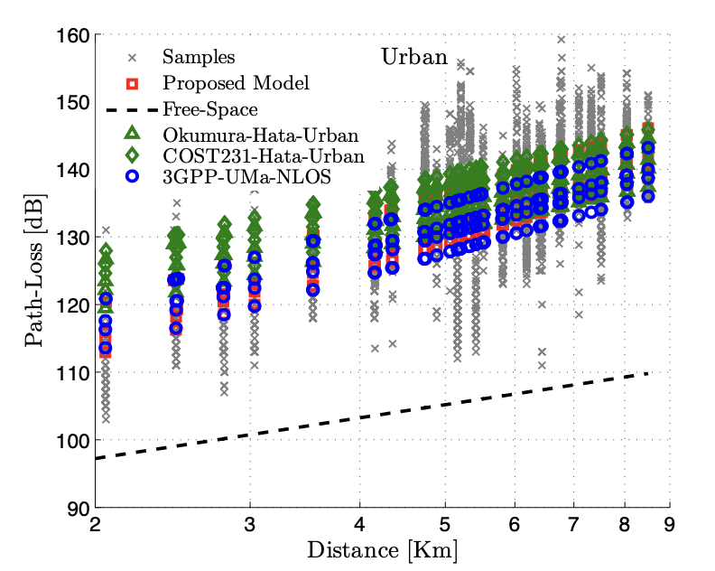

This resource provides open LoRaWAN propagation measurements collected in Lebanon and used to derive path-loss models for LPWAN deployment and coverage estimation.

## Overview

The dataset supports the study of radio propagation for LoRaWAN in the `868 MHz` band. It is associated with extensive measurement campaigns carried out in indoor and outdoor environments, across urban and rural locations in Lebanon. The resulting data was used to derive path-loss models tailored to LoRaWAN communications and to evaluate coverage and performance in real deployment settings.

## What is included

- measurement campaigns from Saint Joseph University campus, Beirut city, and Bekaa valley
- indoor and outdoor scenarios
- urban and rural environments
- three end-device antenna heights: `0.2 m`, `1.5 m`, and `3 m`
- a `Readme_data` file describing the measurements
- a Matlab function implementing the proposed path-loss model

## Measurement context

According to the publication, the campaigns were designed to characterize LoRaWAN propagation in:

- indoor multi-floor university buildings
- a suburban campus environment
- dense urban areas in Beirut
- rural areas in Bekaa valley

The paper reports that the derived models are both accurate and simple to apply in Lebanon and similar environments, with observed coverage ranges up to `8 km` in urban areas and `45 km` in rural areas.

## Why it matters

This resource corresponds directly to the LPWAN propagation contribution described in [Section 1 of the Contributions page](https://samer.lahoud.fr/contributions/). It supports coverage estimation, deployment planning, and performance evaluation for LoRaWAN systems in real environments, and provides one of the clearest examples of a lab artifact that connects open data, modeling, and publication.

## Access

- Dataset record: [Zenodo](https://zenodo.org/records/1560654)
- DOI: [10.5281/zenodo.1560654](https://doi.org/10.5281/zenodo.1560654)
- License: `CC BY 4.0`

## Related publication

- R. El Chall, S. Lahoud, M. El Helou, *LoRaWAN Network: Radio Propagation Models and Performance Evaluation in Various Environments in Lebanon*. [PDF](https://samer.lahoud.fr/pub-pdf/jiot-19.pdf)

## Example result

This preview corresponds to **Figure 11(a)** from the related publication. It illustrates the propagation modeling component of the resource and gives a concrete example of the type of result supported by the measurement campaign.

## Citation

If you use this resource, please cite the Zenodo dataset and the related publication above.
