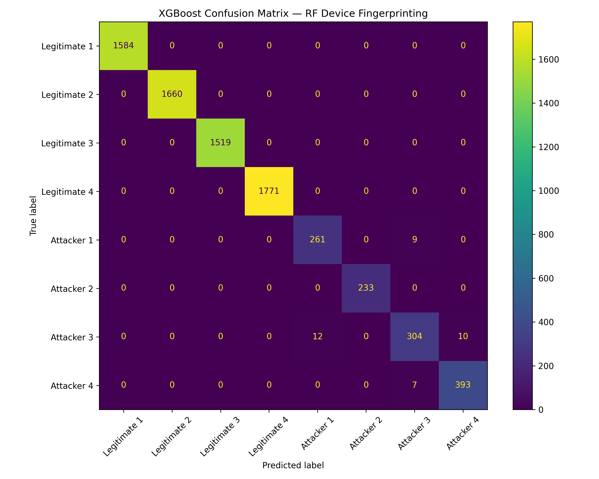

This resource provides protocol-level emulated Wi-Fi 802.11 signal traces with hardware impairments, designed for RFFI-based impersonation detection research.

## Overview

The dataset supports the study of radio frequency fingerprinting identification (RFFI) for detecting device impersonation in Wi-Fi networks. Signals are emulated using GNU Radio with device-specific hardware impairments including CFO and IQ imbalance, along with basic channel effects. Each legitimate device has a unique hardware fingerprint, while attacker devices share the MAC address of their target legitimate device while retaining distinct hardware characteristics.

## What is included

- IQ traces for 4 legitimate devices
- IQ traces for 4 attacker devices, each impersonating a corresponding legitimate device
- hardware impairments: CFO and IQ imbalance
- channel effects: basic propagation simulation via GNU Radio
- `scripts/analyze.py` for feature extraction and XGBoost-based device classification

## Dataset context

Each `.npy` file contains complex64 IQ samples with a packet length of 3840 samples. The dataset was generated to evaluate unsupervised anomaly detection for Wi-Fi impersonation attacks at the protocol level, complementing the signal-level synthetic dataset.

| File | Type | Packets |
|------|------|---------|
| `legitimate_device_01.npy` | Legitimate | 7919 |
| `legitimate_device_02.npy` | Legitimate | 8299 |
| `legitimate_device_03.npy` | Legitimate | 7595 |
| `legitimate_device_04.npy` | Legitimate | 8854 |
| `attacker_device_05_impersonates_01.npy` | Attacker | 1351 |
| `attacker_device_06_impersonates_02.npy` | Attacker | 1167 |
| `attacker_device_07_impersonates_03.npy` | Attacker | 1630 |
| `attacker_device_08_impersonates_04.npy` | Attacker | 1999 |

## Why it matters

This dataset offers a reproducible setting for evaluating RFFI-based anomaly detection under protocol-level emulation, providing a more realistic benchmark than purely synthetic signal-level data.

## Access

- Dataset: [Zenodo](https://doi.org/10.5281/zenodo.20186947)
- DOI: [10.5281/zenodo.20186947](https://doi.org/10.5281/zenodo.20186947)
- License: `CC BY 4.0`

## Related publication

- X. Li, S. Lahoud, N. Zincir-Heywood, *Unsupervised Anomaly Detection for Wi-Fi Networks using RFFI*. 2025 21st International Conference on Network and Service Management (CNSM). [DOI](https://doi.org/10.23919/CNSM67658.2025.11297558)

## Example result

This preview shows the XGBoost classification confusion matrix on the protocol-level emulated dataset, illustrating the separability of device-specific RF fingerprints across legitimate and attacker devices.

## Citation

If you use this resource, please cite the related publication above.