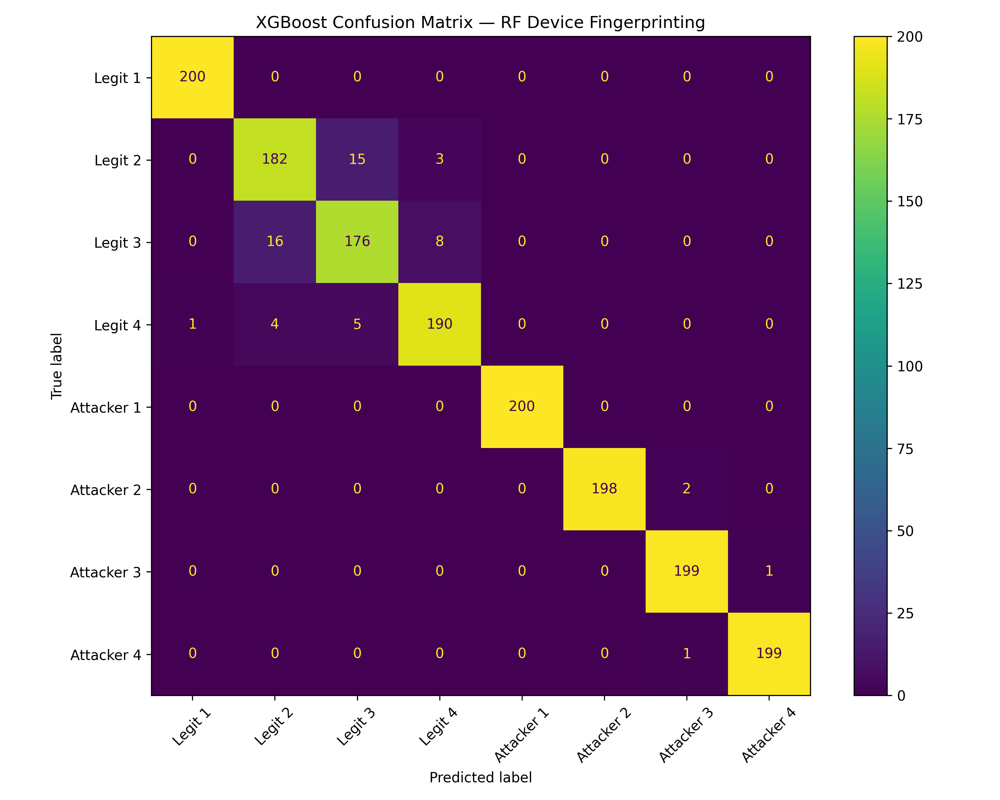

This resource provides synthetic Wi-Fi signal traces generated at the bit level with hardware impairments, designed for RFFI-based impersonation detection research.

## Overview

The dataset supports the study of radio frequency fingerprinting identification (RFFI) for detecting device impersonation in Wi-Fi networks. Signals are generated at the bit level using 16-QAM and OFDM modulation, with device-specific hardware impairments including CFO, IQ imbalance, phase noise, and non-linear distortions. Transmission effects are simulated using additive white Gaussian noise and Rayleigh fading channels.

## What is included

- IQ traces for 4 legitimate devices under `data/legitimate/`
- IQ traces for 4 attacker devices under `data/attacker/`, each impersonating a corresponding legitimate device
- hardware impairments: CFO, IQ imbalance, phase noise, non-linear distortion
- channel effects: AWGN and Rayleigh fading
- `scripts/analyze.py` for feature extraction and XGBoost-based device classification

## Dataset context

The dataset was generated to evaluate unsupervised anomaly detection for Wi-Fi impersonation attacks. Each legitimate device has unique hardware fingerprint parameters assigned via a separable parameter grid. Attacker devices share the MAC address of their target legitimate device while retaining distinct hardware characteristics, simulating realistic impersonation scenarios.

Each `.npy` file contains `1000` signal samples per device with shape `(1000, signal_length)`.

## Why it matters

This dataset offers a reproducible setting for evaluating RFFI-based anomaly detection under controlled hardware impairments and channel conditions.

## Access

- Dataset and code: [GitHub](https://github.com/samerlahoud/spark-lab-site/tree/main/artifacts/wifi-rffi-signal-level-synthetic)
- License: `CC BY 4.0`

## Related publication

- X. Li, S. Lahoud, N. Zincir-Heywood, *Unsupervised Anomaly Detection for Wi-Fi Networks using RFFI*. 2025 21st International Conference on Network and Service Management (CNSM). [DOI](https://doi.org/10.23919/CNSM67658.2025.11297558)

## Example result

This preview shows the XGBoost classification confusion matrix on the synthetic dataset, illustrating the separability of device-specific RF fingerprints across legitimate and attacker devices.

## Citation

If you use this resource, please cite the related publication above.